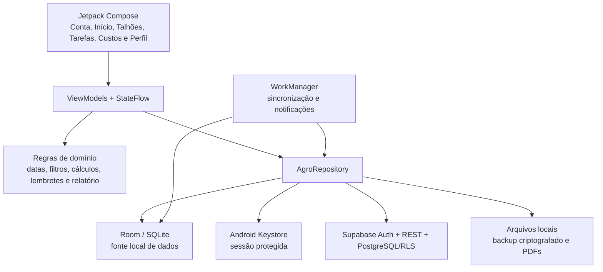

# AgroGestão Pro

Aplicativo Android de gestão rural voltado principalmente a produtores familiares e pequenas propriedades. O projeto reúne cadastro de talhões/safras, tarefas, fluxo de caixa, relatórios informativos para crédito rural, lembretes, backup protegido e sincronização opcional com Supabase.

> **Estado atual:** beta funcional (`1.2.0-beta14`, `versionCode 14`). A aplicação já possui persistência local, autenticação, sincronização, clima opcional, exportação e testes, mas ainda não deve ser apresentada como um ERP agrícola completo nem como produto pronto para operação crítica sem validação com usuários reais e revisão jurídica/agronômica.

Esta é a documentação técnica e de produto vigente em **4 de agosto de 2026**. O arquivo [`documentos anteriores/documentacao_agrogestao.pdf`](documentos%20anteriores/documentacao_agrogestao.pdf) descreve uma fase conceitual anterior e não deve ser usado como fonte do estado atual.

## Sumário

- [Visão geral](#visão-geral)
- [O que já está implementado](#o-que-já-está-implementado)
- [Arquitetura](#arquitetura)
- [Modelo de dados](#modelo-de-dados)
- [Funcionamento offline e sincronização](#funcionamento-offline-e-sincronização)
- [Segurança e privacidade](#segurança-e-privacidade)
- [Como configurar e executar](#como-configurar-e-executar)
- [Testes e qualidade](#testes-e-qualidade)
- [Comparação com outras opções](#comparação-com-outras-opções)
- [Pontos fortes, limitações e riscos](#pontos-fortes-limitações-e-riscos)
- [Roadmap recomendado](#roadmap-recomendado)
- [Estrutura do repositório](#estrutura-do-repositório)

## Visão geral

### Problema que o projeto tenta resolver

Pequenos produtores frequentemente precisam controlar tarefas, safras e movimentações financeiras em locais com conexão instável. Planilhas e cadernos são flexíveis, mas exigem disciplina manual e não oferecem, por padrão, relações consistentes entre talhão, tarefa, despesa e relatório. Plataformas agrícolas completas resolvem uma parte maior da operação, porém podem introduzir mais configuração, treinamento e custo do que um piloto enxuto precisa.

O AgroGestão Pro ocupa uma posição intermediária: oferece dados estruturados e fluxos agrícolas essenciais em um aplicativo Android relativamente simples, mantendo o uso local quando não há internet e sincronizando quando uma conta e um backend estiverem disponíveis.

### Público mais compatível hoje

- produtor individual ou familiar;
- pequena propriedade com operação predominantemente agrícola;
- uso principal em celular Android;
- necessidade de registrar tarefas, talhões, receitas e despesas sem depender de conexão contínua;
- piloto, projeto acadêmico, validação de produto ou implantação controlada com suporte próximo.

### O que o projeto não é

- não é sistema contábil ou fiscal;
- não emite NF-e, MDF-e ou documentos bancários;
- não controla estoque, máquinas, insumos ou rebanho de forma completa;
- não oferece recomendação agronômica, análise de crédito ou garantia de financiamento;
- não possui colaboração entre funcionários da mesma fazenda;
- não possui cliente para iOS, web ou desktop;
- não comprova conformidade com LGPD apenas por utilizar criptografia e RLS.

## O que já está implementado

| Área | Recursos atuais | Observações |
| --- | --- | --- |
| Conta | Cadastro, login, confirmação por deep link, reenvio, recuperação e troca de senha, renovação de sessão e logout | Recuperação usa link do Supabase e ainda precisa de validação live com conta temporária |
| Uso local | Perfil local sem conta remota | Permite testar e trabalhar sem Supabase; a nuvem fica indisponível |
| Hoje | Prioridade mais urgente, resumo do dia e fluxo guiado “Atualizar meu dia” | Pergunta o que foi plantado, colhido, comprado, vendido, pago ou recebido; reaproveita escolhas recentes e pode alimentar histórico, terreno e caixa |
| Modo Simples | É recomendado por padrão para novos usuários, amplia componentes e áreas de toque, usa perguntas curtas e navegação Início/Tarefas/Terrenos/Mais | O modo completo continua disponível e escolhas já feitas permanecem persistentes por conta |
| Talhões/safras | Cadastro, edição, exclusão, área, datas, progresso e situação de manejo | O nome da tabela histórica é `safras`, embora a interface use também o conceito de talhão |
| Tarefas | Lista e quadro Kanban, três estados, filtros, edição, prazo, categoria e vínculo opcional com safra | Estados: a fazer, em progresso e concluído |
| Lembretes | Notificações locais configuráveis de 0 a 7 dias antes, com horário escolhido | São isoladas por conta e revalidadas antes da entrega |
| Financeiro | Receitas, despesas, categorias, datas, filtros, saldo e associação opcional com safra | É um fluxo de caixa simples, não contabilidade formal |
| Relatório | Resumo de crédito rural em PDF A4, período selecionável, completude, origem e estado de sincronização | O PDF inclui aviso de que não é documento oficial nem garante crédito |
| Consentimento | Autorização explícita, versionada e revogável para gerar/compartilhar relatórios | Consentimento e histórico ficam somente no aparelho |
| Integridade do PDF | Histórico local, hash SHA-256 e bloqueio de arquivo ausente ou modificado | PDFs antigos sem prova de consentimento não são compartilhados |
| Backup | Exportação e restauração em `.agrobackup`, protegida por senha | Restauração faz mesclagem e só aceita o mesmo proprietário lógico |
| Nuvem | Sincronização bidirecional de perfil, safras, tarefas e financeiro | Supabase opcional, com RLS e compatibilidade limitada com esquema legado |
| Clima | Previsão de sete dias por município, consentimento, cache offline, fonte e alertas informativos | Usa Open-Meteo sem GPS; é opcional e revogável |
| CSV | Exportação financeira do período selecionado com metadados auditáveis | Inclui versão, geração, propriedade, centavos e identificadores |
| Conflitos | Trilha local das versões concorrentes encontradas na sincronização | Informa se a nuvem venceu ou se a alteração local foi mantida |

## Arquitetura

O projeto é um único módulo Android nativo. A interface usa Jetpack Compose e observa `StateFlow`s expostos pelos ViewModels. O repositório central coordena o banco local, autenticação, sincronização, backup e histórico de relatórios.



### Camadas e responsabilidades

- **Apresentação:** telas Compose, componentes reutilizáveis, navegação e ViewModels.
- **Domínio:** cálculos financeiros, datas ISO, filtros, política de sessão, montagem do relatório e planejamento de lembretes.
- **Dados locais:** Room, DAOs, migrations e armazenamento de consentimento/histórico.
- **Dados remotos:** cliente REST próprio para Supabase Auth e PostgREST.
- **Trabalho em segundo plano:** WorkManager para sincronização periódica, sincronização na abertura e lembretes.
- **Arquivos:** codec de backup, gerador de PDF e armazenamento verificado por hash.

Essa separação existe, mas não é uma Clean Architecture estrita: `AgroRepository.kt` concentra muitas responsabilidades e já possui cerca de 1.450 linhas. Algumas telas Compose também ultrapassam 900 linhas. Antes de ampliar muito o produto, é recomendável dividir autenticação, sincronização, backup e relatórios em serviços/repositórios menores.

### Tecnologias principais

| Tecnologia | Uso |
| --- | --- |
| Kotlin 2.1 | Linguagem principal |
| Jetpack Compose + Material 3 | Interface declarativa |
| Navigation Compose | Navegação entre as sete rotas, com conjuntos distintos para os modos completo e simples |
| Room 2.6.1 | Persistência local e migrations |
| Kotlin Coroutines/Flow | Operações assíncronas e estado reativo |
| WorkManager 2.10 | Sincronização e lembretes persistentes |
| Supabase | Autenticação, Postgres, PostgREST e RLS |
| Android Keystore + AES-GCM | Proteção dos tokens de sessão |
| AES-GCM + PBKDF2 | Proteção dos arquivos de backup |
| Android `PdfDocument` | Geração dos relatórios PDF |
| JUnit + AndroidX Test | Testes unitários e instrumentados |

## Modelo de dados

O banco Room está na versão **11** e possui sete entidades.

| Entidade/tabela | Finalidade | Relações e detalhes |
| --- | --- | --- |
| `produtor` | Perfil único da instalação/conta ativa | Chave fixa `id = 1`; contém identificação da propriedade e estado de login |
| `safras` | Talhões ou ciclos de cultivo | Área, início, previsão de colheita, progresso e manejo |
| `tarefas` | Atividades agrícolas | Vínculo opcional com `safras` por `cropCloudId` |
| `financeiro` | Receitas e despesas | Vínculo opcional com `safras` por `cropCloudId` |
| `report_history` | Metadados dos PDFs arquivados | Conta, período, totais, completude, hash, tamanho e versão |
| `report_consent` | Estado local de consentimento | Versão, aceite, revogação e isolamento por proprietário |
| `sync_conflicts` | Auditoria local de conflitos | Tipo, registro, timestamps e resolução, isolados por conta |

Safras, tarefas e lançamentos usam um ID numérico local do Room e um UUID permanente (`cloudId`) para sincronização. Também possuem `ownerUserId`, `syncStatus`, `updatedAtEpochMillis` e `isDeleted`, o que permite isolamento local, controle de pendências e propagação de exclusões.

### Histórico de migrations

- `2 -> 3`: token de acesso legado;
- `3 -> 4`: tombstones de exclusão;
- `4 -> 5`: refresh token e expiração;
- `5 -> 6`: identidade e metadados de nuvem;
- `6 -> 7`: associação entre safra, tarefa e lançamento;
- `7 -> 8`: histórico de relatórios;
- `8 -> 9`: versão do relatório e consentimento.
- `9 -> 10`: valores financeiros migrados de `REAL/Double` para centavos inteiros;
- `10 -> 11`: trilha local de conflitos de sincronização.

Como o schema v1 nunca foi exportado, a migration `1 -> 2` usa recuperação assistida: recria o primeiro schema conhecido e preserva todas as tabelas/colunas reconhecidas com defaults seguros. Não existe mais fallback destrutivo silencioso. A atualização v1 sintética está coberta por teste instrumentado, mas um APK v1 real ainda deve ser incluído no piloto de atualização.

## Funcionamento offline e sincronização

### Fonte de verdade local

Toda criação, edição ou exclusão é registrada primeiro no Room. Por isso, as funções principais continuam disponíveis sem conexão. O registro recebe estado local/pendente e uma tentativa de sincronização é feita em seguida.

### Quando a sincronização ocorre

- depois de alterações em perfil, safra, tarefa ou financeiro;
- manualmente pelo painel;
- uma vez na abertura do aplicativo, se houver rede;
- periodicamente a cada 15 minutos, respeitando a disponibilidade de conexão.

### Estratégia atual

1. valida ou renova a sessão do Supabase;
2. identifica o schema remoto moderno ou legado;
3. baixa primeiro o estado remoto;
4. aplica localmente mudanças remotas mais novas;
5. envia registros locais ainda não sincronizados;
6. confirma que não restaram pendências.

No schema moderno, as tabelas remotas usam UUID, `user_id`, `updated_at` e `is_deleted`. As políticas RLS permitem que uma conta leia e altere somente as próprias linhas. Exclusões são representadas por tombstones até serem propagadas.

### Resolução de conflito

A mudança com maior `updated_at` vence. A estratégia é simples e adequada para a fase beta, mas não faz mesclagem campo a campo nem apresenta conflitos ao usuário. Relógios incorretos nos aparelhos também podem influenciar o resultado. Para uso simultâneo intenso em vários dispositivos, o ideal é adotar versão de registro ou timestamp confiável do servidor e manter um log de conflitos.

## Segurança e privacidade

### Proteções já presentes

- tokens de acesso e renovação criptografados com AES-GCM e chave não exportável do Android Keystore;
- migração e remoção dos tokens legados que eram armazenados no Room;
- sessão protegida excluída do backup e da transferência de dispositivo do Android;
- HTTPS obrigatório na configuração do Supabase;
- chave pública/publishable injetada no build; a chave `service_role` não deve entrar no app;
- RLS no banco remoto por `auth.uid()`;
- isolamento local de registros pelo proprietário;
- backup `.agrobackup` com AES-GCM, senha mínima de oito caracteres, PBKDF2, salt e IV aleatórios;
- limites de tamanho, quantidade, formato, UUID e datas ao importar backup;
- hash SHA-256 do PDF antes de cada compartilhamento;
- `FileProvider` e validação de caminho canônico para compartilhar somente arquivos permitidos;
- consentimento explícito antes de gerar ou compartilhar relatório.

### Limites que precisam ficar claros

- o banco Room com perfil, CAF/DAP, safras e finanças não possui criptografia própria; ele depende do sandbox e das proteções do aparelho Android;
- o backup automático do Android está habilitado e exclui a sessão, mas as regras de retenção dos demais dados precisam ser revisadas como parte da política de privacidade;
- a existência de criptografia, consentimento e RLS não equivale a uma auditoria de segurança ou conformidade LGPD;
- não há política de privacidade, termos, processo de atendimento ao titular ou plano de resposta a incidentes neste repositório;
- o backup usa `PBKDF2WithHmacSHA1` por compatibilidade. Uma futura versão do formato deve avaliar PBKDF2-HMAC-SHA-256 ou uma KDF moderna, mantendo migração dos arquivos existentes;
- o relatório de crédito é informativo e baseado no que o próprio produtor cadastrou. Ele não substitui CAF/DAP, projeto técnico, extratos ou comprovantes;
- a revogação bloqueia novos compartilhamentos pelo app, mas não recolhe cópias que o usuário já tenha enviado para terceiros.

## Como configurar e executar

### Requisitos

- Android Studio com Android SDK 35;
- JDK 21 recomendado para reproduzir a validação atual;
- dispositivo ou emulador Android 7.0/API 24 ou superior;
- projeto Supabase apenas se autenticação e sincronização forem necessárias.

O código compila bytecode Java 17. O AGP 8.8 exige no mínimo JDK 17 ([notas oficiais](https://developer.android.com/build/releases/agp-8-8-0-release-notes)), mas o build deste repositório foi validado com JDK 21. Evite JDK 25 nesta versão: o Kotlin/Gradle atual falha ainda na leitura dos scripts com `IllegalArgumentException: 25.0.2`.

### 1. Configurar o Android SDK e o backend

No `local.properties` da raiz, mantenha o caminho do SDK e, para ativar a nuvem, acrescente:

```properties
sdk.dir=C\:\caminho\para\Android\Sdk
SUPABASE_URL=https://SEU_PROJECT_REF.supabase.co
SUPABASE_ANON_KEY=SUA_CHAVE_PUBLICA_OU_PUBLISHABLE
```

Também é possível fornecer `SUPABASE_URL` e `SUPABASE_ANON_KEY` como variáveis de ambiente. O arquivo local `supabase.md` é aceito por compatibilidade, mas está ignorado pelo Git e não deve ser distribuído.

Use `.env.example` ou `local.properties.example` como referência. No GitHub Actions, cadastre `SUPABASE_URL` e `SUPABASE_ANON_KEY` em **Settings → Secrets and variables → Actions**. Credenciais de assinatura de release são opcionais e usam as variáveis `AGRO_RELEASE_*` documentadas no `.env.example`.

Sem essas credenciais o build continua possível e o perfil local funciona, porém cadastro, login e sincronização remota não funcionarão.

### 2. Preparar o Supabase

1. Crie um projeto no Supabase.
2. Execute, na ordem, os scripts em `supabase/migrations/`.
3. Em **Authentication > URL Configuration**, adicione exatamente `com.agrogestao.pro://auth/callback` às URLs de redirecionamento permitidas.
4. Habilite autenticação por e-mail/senha e defina se a confirmação de e-mail será obrigatória.
5. Confirme que as quatro tabelas sincronizadas estão com RLS habilitado.

O redirecionamento móvel precisa estar na allow list do Supabase; consulte a [documentação oficial de Redirect URLs](https://supabase.com/docs/guides/auth/redirect-urls).

Mais detalhes estão em [`supabase/README.md`](supabase/README.md).

### 3. Compilar

PowerShell:

```powershell
$env:JAVA_HOME = 'C:\Program Files\Java\jdk-21'
$env:PATH = "$env:JAVA_HOME\bin;$env:PATH"
.\gradlew.bat assembleDebug
```

Linux/macOS:

```bash
export JAVA_HOME=/caminho/para/jdk-21
./gradlew assembleDebug
```

O APK de desenvolvimento será criado em `app/build/outputs/apk/debug/app-debug.apk`.

### 4. Executar os testes locais

```powershell
.\gradlew.bat testDebugUnitTest
.\gradlew.bat lintDebug
```

Com emulador ou aparelho conectado:

```powershell
.\gradlew.bat connectedDebugAndroidTest
```

Os testes `LiveSupabaseAuthTest` e `LiveSupabaseSyncTest` dependem de configuração e credenciais temporárias apropriadas. Nunca use conta real em rotinas destrutivas de teste.

## Testes e qualidade

O código contém **95 testes automatizados**: 55 unitários e 40 instrumentados.

### Cobertura funcional existente

- cálculos financeiros e validação numérica;
- datas e filtros combinados;
- política de sessão e renovação de token;
- parsing seguro do callback de autenticação;
- política de conflitos e timestamps da nuvem;
- relatório, completude e prova de consentimento;
- cálculo, reagendamento e deduplicação de lembretes;
- DAOs, isolamento por conta e tombstones;
- migrations Room da versão 3 à 9;
- criptografia de sessão no Android Keystore;
- backup, senha incorreta, adulteração e restauração entre contas;
- geração, compartilhamento, integridade e caminho seguro do PDF;
- estados reativos dos filtros;
- testes de ida e volta no Supabase real.
- escolha pré-login, preferência, isolamento por conta e regras de navegação do Modo Simples.
- registro diário guiado, identificação do item/serviço, sugestões recentes, valores em reais, gravação composta em tarefa/caixa/terreno e desfazer seguro.

### Verificação executada em 8 de agosto de 2026

| Comando | Resultado |
| --- | --- |
| `testDebugUnitTest` | 55 testes, 0 falhas, 0 erros, 0 ignorados |
| `lintDebug` | 0 erros e 52 avisos |
| `assembleDebug` | concluído com sucesso usando JDK 21 |
| `bundleRelease` | AAB release gerado; assinatura de produção é configurável por arquivo/variáveis privadas |
| `connectedDebugAndroidTest` | 40 testes no AVD API 36.1, 0 falhas e 2 ignorados por exigirem credenciais temporárias do Supabase |

Os avisos do lint são principalmente dependências desatualizadas, alvo Android já não mais recente, ícone monocromático ausente e uma referência à permissão de notificações da API 33. Eles não impedem o build, mas devem ser triados antes de publicar.

## Comparação com outras opções

Não existe uma resposta honesta em que o AgroGestão Pro seja sempre “melhor”. Ele é superior quando seu recorte específico reduz trabalho e inferior quando o usuário precisa da maturidade, colaboração e amplitude de plataformas consolidadas.

Preço não foi usado como critério: o projeto ainda não define licença comercial, mensalidade, custo de suporte ou custo total de manter o Supabase, enquanto os concorrentes possuem planos que podem mudar.

### Matriz resumida

| Critério | AgroGestão Pro | Excel/Google Sheets | Trello | Plataforma agrícola consolidada, como Aegro |
| --- | --- | --- | --- | --- |
| Uso agrícola pronto | Bom para talhão, tarefa, caixa e relatório básico | Precisa criar modelo, fórmulas e validações | Precisa adaptar quadros e campos | Muito mais amplo e especializado |
| Uso sem internet | Dados locais por padrão; sincroniza depois | Possível, mas arquivos em nuvem precisam ser preparados/abertos para uso offline | Foco principal em colaboração conectada | O Aegro também oferece app de campo offline |
| Financeiro | Entradas, saídas, filtros e saldo | Extremamente flexível, mas manual | Não é financeiro por padrão | Financeiro, estoque, fiscal e integrações mais completos |
| Tarefas | Kanban agrícola, safra, prazo e lembrete local | Possível com montagem manual | Colaboração, automação e integrações mais fortes | Ligação mais profunda com operações de campo |
| Relatório de crédito | PDF específico com consentimento, completude e hash | Pode ser criado manualmente | Não é recurso nativo | Possui relatórios mais amplos, mas com outra proposta |
| Equipe e permissões | Não disponível | Coautoria disponível | É um dos pontos fortes | Disponível em soluções comerciais maduras |
| Plataformas | Somente Android | Web, desktop, Android e iOS | Web e aplicativos | Web e aplicativos de campo |
| Customização do produto | Código e backend sob controle do projeto | Alta no formato da planilha | Alta por automações e integrações | Depende do plano, API e fornecedor |
| Maturidade e suporte | Beta, sem SLA | Ecossistema e suporte amplos | Produto estabelecido | Suporte especializado e operação comercial |

### Em que o AgroGestão Pro pode ser melhor

1. **Fluxo mais dirigido do que uma planilha.** O usuário não precisa criar fórmulas, relações, filtros e validações para começar a registrar o trabalho.
2. **Menos escopo para aprender.** Para quem precisa apenas de talhões, tarefas, caixa e um relatório simples, a interface tende a exigir menos configuração que um ERP amplo. Essa hipótese ainda precisa ser comprovada em testes de campo.
3. **Offline como comportamento padrão.** Os dados operacionais são gravados diretamente no banco local, sem o usuário precisar marcar previamente cada arquivo para uso offline.
4. **Relatório com cautelas explícitas.** Consentimento versionado, indicador de dados ausentes, origem, sincronização e verificação de integridade são recursos bem alinhados ao caso de compartilhamento voluntário.
5. **Implantação controlável.** O responsável pelo projeto escolhe o próprio Supabase e pode adaptar código, modelo e interface ao público local. Isso não torna o projeto open source: não há licença definida no repositório.
6. **Boa base de segurança para uma beta.** Sessão no Keystore, RLS, tombstones, backup criptografado e hash de PDF vão além de um protótipo apenas visual.

### Em que outras opções são melhores

1. **Planilhas vencem em flexibilidade e alcance.** Excel e Sheets permitem cálculos arbitrários, gráficos, importações, colaboração e acesso em várias plataformas. Excel oferece coautoria em versões compatíveis e funcionamento offline quando o arquivo foi preparado no aparelho; arquivos do Google Drive também podem ser marcados para edição offline ([Microsoft: coautoria](https://support.microsoft.com/en-US/Excel/get-started/collaborate-on-excel-workbooks-at-the-same-time-with-co-authoring), [Microsoft: uso offline](https://support.microsoft.com/en-us/word/can-i-work-offline), [Google: arquivos offline no Android](https://support.google.com/drive/answer/2375012?co=GENIE.Platform%3DAndroid)).
2. **Trello vence em trabalho de equipe e automação genérica.** Regras, botões, comandos de calendário e integrações com outros serviços são recursos maduros do produto ([automação](https://trello.com/en/guide/automate-anything), [integrações](https://trello.com/en/integrations)).
3. **Aegro vence em profundidade agrícola e maturidade comercial.** A oferta oficial inclui estoque, fiscal, NF-e/MDF-e, mapas, NDVI, GPS, pragas, máquinas, equipe, integrações e suporte, além de aplicativo offline ([visão geral](https://aegro.com.br/), [gestão rural](https://aegro.com.br/solucoes/gestao-rural/)). O AgroGestão Pro não deve alegar superioridade geral diante desse conjunto.
4. **Produtos estabelecidos vencem em suporte e risco operacional.** O projeto ainda não tem SLA, central de atendimento, telemetria de produção, política formal de incidentes ou histórico público de disponibilidade.
5. **Alternativas multiplataforma vencem equipes heterogêneas.** Hoje um produtor com iPhone ou alguém que trabalha principalmente no computador não possui cliente do AgroGestão Pro.

### Decisão recomendada por cenário

| Cenário | Opção mais racional |
| --- | --- |
| Produtor individual, Android, internet irregular e fluxo simples | AgroGestão Pro pode ser a melhor experiência, após piloto controlado |
| Operação ainda informal que muda de modelo toda semana | Planilha bem estruturada |
| Equipe precisa colaborar, comentar, automatizar e integrar ferramentas | Trello ou solução equivalente |
| Fazenda precisa de estoque, fiscal, mapas, máquinas, pragas, equipe e suporte | Plataforma agrícola consolidada |
| Instituição precisa de documento oficial para decidir crédito | Documentos oficiais e análise própria; o PDF do app é apenas apoio |

## Pontos fortes, limitações e riscos

### Pontos fortes comprovados pelo código

- arquitetura offline-first com banco local reativo;
- sincronização bidirecional e isolamento por usuário;
- possibilidade de operar em perfil local sem backend;
- proteção diferenciada para sessão, backup e PDFs;
- migrations explícitas e schemas exportados;
- testes em regras críticas, persistência, segurança e integração;
- interface focada e em português;
- validação de datas, números, associações e períodos;
- mensagens que evitam prometer aprovação de crédito.

### Limitações funcionais atuais

- Android apenas;
- uma propriedade/perfil ativo por instalação;
- recuperação e troca de senha implementadas, ainda sem validação live do e-mail de recuperação nesta rodada;
- sem membros, papéis ou aprovação de tarefas;
- sem estoque, fornecedores, contas a pagar/receber, fiscal, máquinas, mapa, GPS, imagens, pragas ou rebanho completo;
- sem importação CSV; exportação financeira já está disponível;
- histórico de PDF, consentimento e preferências de lembrete não sincronizam;
- restauração de backup bloqueada quando o identificador da conta muda, mesmo que seja a mesma pessoa após recriação da conta;
- valores financeiros persistidos e somados em centavos inteiros; APIs e exibição ainda convertem na borda para reais;
- resolução automática de conflito por “última alteração vence”, agora com trilha consultável, mas sem mesclagem campo a campo.

### Riscos técnicos e de produto

- `AgroRepository` e telas grandes aumentam custo de manutenção e teste;
- versão release está com minificação desabilitada; assinatura/AAB estão configurados e documentados, mas a chave real depende do responsável pela publicação;
- há CI para testes, lint, APK e padrões de segredos; ainda faltam política de versionamento formal, `LICENSE`, `CONTRIBUTING` e processo de revisão;
- lint ainda possui 52 avisos e várias dependências estão atrás das versões atuais;
- `targetSdk 35` já é sinalizado pelo lint como não sendo o alvo mais recente; requisitos da Play Store devem ser verificados antes da publicação;
- o schema Room v1 continua desconhecido; a recuperação assistida elimina deleção silenciosa, mas precisa ser validada contra um banco v1 real;
- o banco de negócio não é criptografado em nível de arquivo;
- não há monitoramento de falhas, métricas de produção ou mecanismo de migração remota controlada;
- não existem evidências documentadas de pesquisa com produtores, taxa de conclusão de tarefas, retenção ou ganho financeiro;
- o nome “AgroGestão Pro” e a identidade visual precisam de pesquisa de marca antes de comercialização.

## Roadmap recomendado

O plano detalhado existente está em [`PROXIMAS_ALTERACOES.md`](PROXIMAS_ALTERACOES.md). A ordem recomendada, considerando risco e valor, é:

1. **Validar recuperação de acesso:** executar o e-mail e a troca de senha com conta temporária real, incluindo link expirado e limite de envio.
2. **Estabilização para publicação:** eliminar a migration v1 destrutiva, migrar dinheiro para centavos exatos, corrigir avisos relevantes, atualizar alvo/dependências e configurar release assinada/AAB.
3. **Privacidade e segurança operacional:** política de privacidade, retenção, revisão do Android Auto Backup, criptografia dos dados locais conforme o risco e teste de segurança.
4. **Refatoração:** separar repositórios de autenticação, sincronização, backup e relatórios; quebrar telas grandes; introduzir interfaces e injeção de dependências.
5. **Desempenho:** paginação, consultas para históricos maiores, telemetria consentida e controle de tentativas de sincronização.
6. **Portabilidade:** CSV, exportação auditável e estratégia para recuperar backup após mudança legítima de conta.
7. **Clima opcional:** consulta por município, consentimento, fonte, cache e indicação de desatualização.
8. **Validação de mercado:** pilotos com produtores, métricas de uso, suporte e decisão consciente entre manter produto enxuto ou avançar para equipe/estoque/fiscal.

## Estrutura do repositório

```text
appAgroGestao/
├── app/
│   ├── src/main/                 # Código Android e recursos
│   ├── src/test/                 # 55 testes unitários
│   ├── src/androidTest/          # 40 testes instrumentados
│   ├── schemas/                  # Schemas Room exportados
│   └── build.gradle.kts          # Configuração do módulo
├── gradle/                       # Wrapper e catálogo de versões
├── .github/workflows/            # CI: testes, lint, segredos e APK debug
├── supabase/
│   ├── migrations/               # Schema, triggers, RLS e associações
│   └── README.md                 # Configuração do backend
├── releases/                     # APKs beta para teste
├── PLANO_EXPANSAO.md             # Histórico e visão ampla de evolução
├── PROXIMAS_ALTERACOES.md        # Próximos ciclos planejados
└── README.md                     # Esta documentação
```

Diretórios `build/`, `app/build/` e `tmp/` são saídas ou artefatos de verificação e não devem ser tratados como código-fonte.

## Distribuição e licença

Os APKs em `releases/` são artefatos beta de teste. Antes de distribuir publicamente, documente assinatura, hash, canal de atualização, política de privacidade, compatibilidade, rollback e origem de cada build.

Este repositório não contém um arquivo `LICENSE`. Portanto, o fato de o código estar disponível no diretório não concede automaticamente permissão pública para copiar, modificar ou redistribuir. Defina uma licença antes de abrir o projeto para terceiros.

## Documentos relacionados

- [`supabase/README.md`](supabase/README.md): preparação do backend e estratégia de sincronização;
- [`PLANO_EXPANSAO.md`](PLANO_EXPANSAO.md): diagnóstico e histórico de implementação;
- [`PROXIMAS_ALTERACOES.md`](PROXIMAS_ALTERACOES.md): roadmap das próximas betas;
- [`documentos anteriores/documentacao_agrogestao.pdf`](documentos%20anteriores/documentacao_agrogestao.pdf): registro histórico da fase conceitual, atualmente desatualizado.
